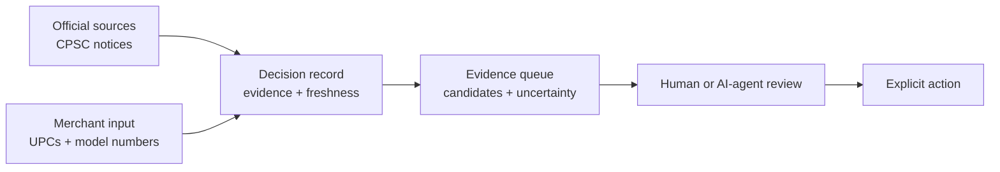

# Agent Data Oracle

Reliable evidence for decisions made by people and AI agents.

Agent Data Oracle turns scattered, changing source material into structured,
time-stamped decision records: answers with their supporting evidence,
freshness, identity constraints, and uncertainty intact. It is for workflows
where finding a webpage is easy, but acting on an incomplete or stale answer
is costly.



Source, time, match, and uncertainty stay together; the record is a review
aid, not a safety, legal, or compliance verdict.

The project begins with a deliberately narrow use case: helping U.S.-selling
merchants compare product identifiers with official CPSC recall notices. It
returns an evidence queue of possible matches, the fields that support them,
unresolved constraints, retrieval time, and the original notice - so a person
or agent can inspect the basis for a decision.

It does **not** decide that a product is safe, recalled, legal, compliant, or
ready to remove. The merchant remains the decision-maker. The goal is not to
add another way to search the web; it is to make high-consequence information
more reliable and accountable at the moment of action.

## What makes a decision record useful

- **Inspectable:** evidence stays connected to the answer rather than being
  hidden behind a summary.
- **Time-aware:** records preserve when information was retrieved and can be
  reviewed as sources change.
- **Honest about identity and uncertainty:** candidate matches and unresolved
  constraints are explicit, not converted into false certainty.
- **Built for workflows:** the same structured evidence can support a human
  review queue, an application, or a bounded AI-agent task.

The initial recall workflow is a test of that value proposition, not a claim
that demand or a long-term advantage has already been proven. Durable value
will have to be earned through record quality, refresh history, better entity
resolution, and verified, permissioned outcomes.

## Prerequisites

- Python 3.13.4
- [uv](https://docs.astral.sh/uv/) 0.7.15
- Docker with Compose

Python dependencies resolve exactly from the committed `uv.lock` file. The
same package supplies the web runtime, migration command, and short-lived job
runtime.

## Run locally

Start the repository-isolated PostgreSQL service, install the locked
dependencies, apply migrations explicitly, and launch the web process:

```console
docker compose up -d --wait postgres
uv sync --locked
uv run agent-data-oracle migrate
uv run agent-data-oracle web --host 127.0.0.1 --port 8080
```

Open <http://127.0.0.1:8080>. Process and database health are separate:

```console
curl http://127.0.0.1:8080/live
curl http://127.0.0.1:8080/ready
```

Local mode uses an in-memory email capture provider and non-secure localhost
cookies. Tests inject that provider to follow passwordless links without ever
printing token values. A deployed environment must set `APP_ENV=production`, a
stable `AUTH_SECRET` of at least 24 bytes, canonical HTTPS `PUBLIC_ORIGIN`, one
or more comma-separated `FOUNDER_EMAILS`, and Secret Manager-supplied
`GMAIL_OAUTH_CLIENT_ID`, `GMAIL_OAUTH_CLIENT_SECRET`, and
`GMAIL_OAUTH_REFRESH_TOKEN` values. Production
sessions are `Secure`, HTTP-only, same-site cookies; sign-in links expire after
15 minutes and sessions after 12 hours.

The local default database URL targets the Compose service. Set
`DATABASE_URL` to a SQLAlchemy `postgresql+psycopg://` URL in other
environments. Migrations never run implicitly when the web process starts.

Run a named short-lived job from the same package:

```console
uv run agent-data-oracle job database-check
```

Import a recorded CPSC API response without contacting the live source, then
inspect the current completed revision and last run state:

```console
uv run agent-data-oracle job cpsc-import-fixture \
  --fixture tests/fixtures/cpsc/recall-10887.json \
  --observed-at 2026-09-04T00:00:00Z \
  --expected-record-count 1 \
  --source-url 'https://www.saferproducts.gov/RestWebServices/Recall?RecallID=10887&format=json'
uv run agent-data-oracle job cpsc-status
```

The import stores the received response bytes, creates content-addressed recall
versions and immutable observations, and promotes the complete revision and
current projection in one PostgreSQL transaction. The required expected count
rejects truncated fixture responses. Rejected input and failed promotion are
recorded but never replace the current completed revision. The status output
contains revision metadata and counts, not source payloads.

For a reproducible local evidence-queue walkthrough after importing the
fixture, see [View a local evidence queue](docs/local-evidence-queue-demo.md).

## Production provisioning

The founder-led Frankfurt deployment is intentionally confirmation-gated and
does not activate the usage-learning phase. Review
[the provisioning checklist](docs/provision-gcp.md), then run the interactive
wizard from Git Bash or another Bash-compatible terminal:

```console
bash scripts/provision-gcp.sh
```

The wizard stores only non-secret progress values in ignored
`.provisioning.env`; enter production secrets directly into Secret Manager. It
includes an explicit Cloud SQL “park or go live” step: a parked database keeps
its data but makes the deployed application unavailable to users. The bounded
phase may use a founder-controlled consumer Gmail sender without a Workspace
subscription; the wizard records whether a separate free sender or the
founder's existing account was chosen. Durable OAuth also requires one
founder-controlled domain for public branding pages, but the application stays
on `run.app`. The wizard keeps all OAuth secrets out of the progress file.

## Quality gates

With the Compose database running:

```console
uv run ruff format --check src tests migrations
uv run ruff check src tests migrations
uv run mypy src
uv run pytest
docker build --tag agent-data-oracle:local .
docker compose --profile tools run --rm gitleaks
```

The integration suite uses `TEST_DATABASE_URL` when set and otherwise targets
the local Compose database. CI runs unit, migration, and real-PostgreSQL tests
as distinct gates, then builds the production image and scans the repository
for secrets.

## Container roles

The image starts the web process by default and accepts the same command
overrides used for Cloud Run Jobs:

```console
docker run --rm -p 8080:8080 \
  -e DATABASE_URL=postgresql+psycopg://... \
  agent-data-oracle:local

docker run --rm \
  -e DATABASE_URL=postgresql+psycopg://... \
  agent-data-oracle:local migrate

docker run --rm \
  -e DATABASE_URL=postgresql+psycopg://... \
  agent-data-oracle:local job database-check
```

Application request logs are JSON. Each request receives a server-generated
`X-Correlation-ID`; logs include only method, path, response status, and that
identifier by default—never request bodies or query values.
